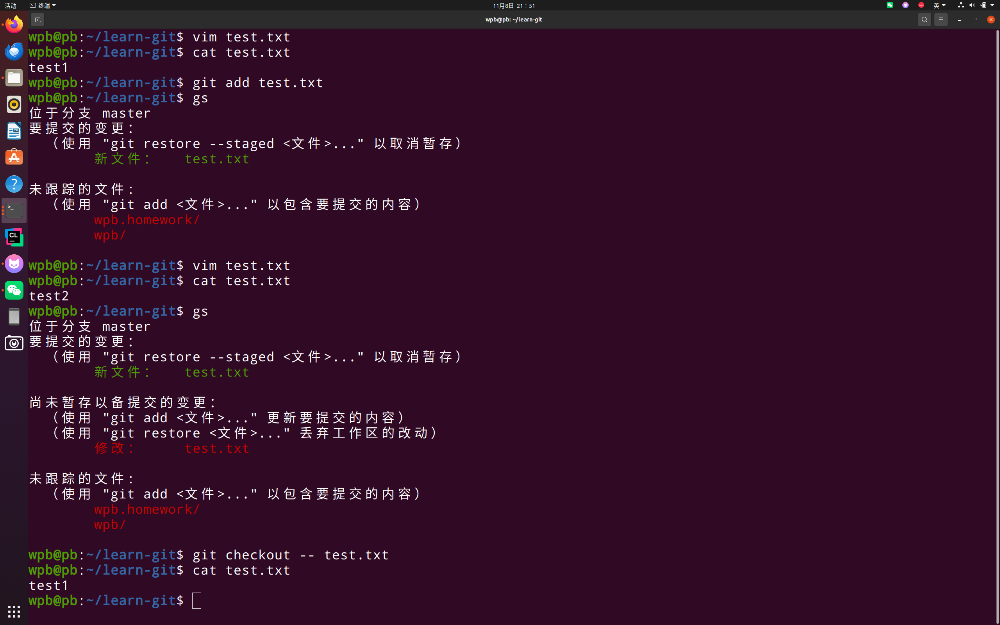
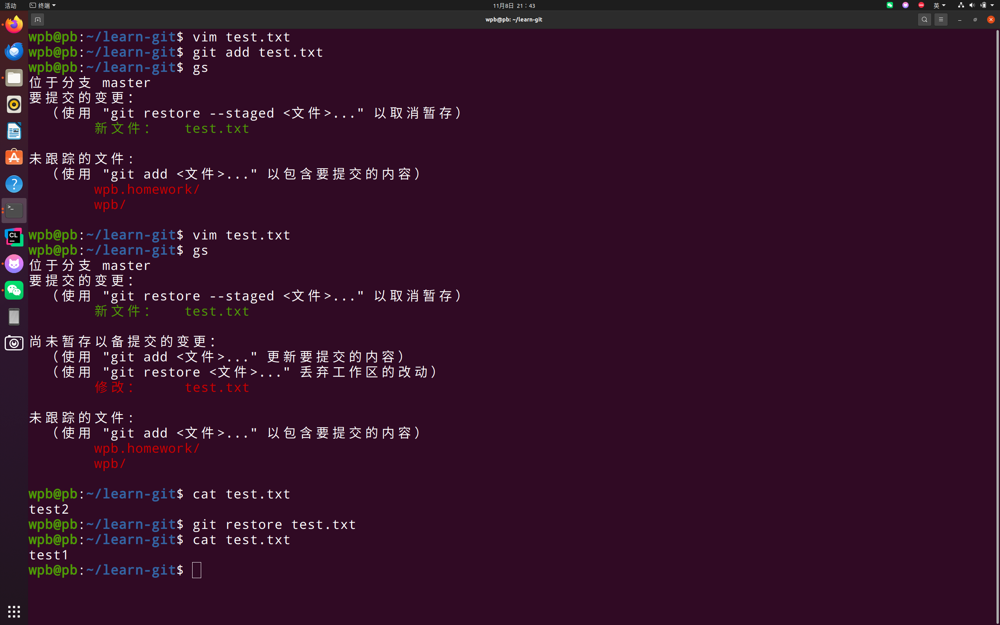
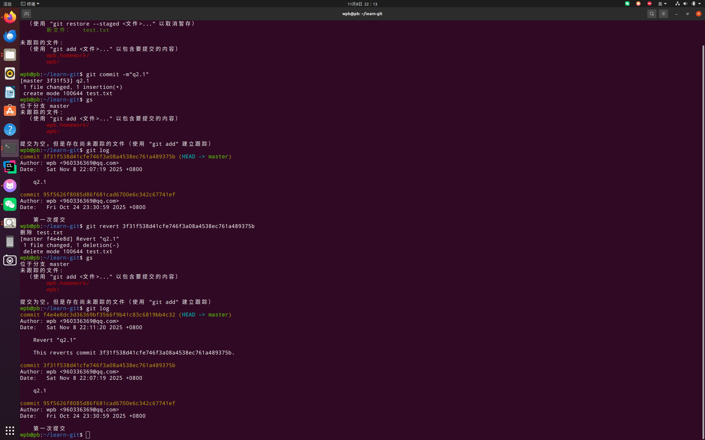
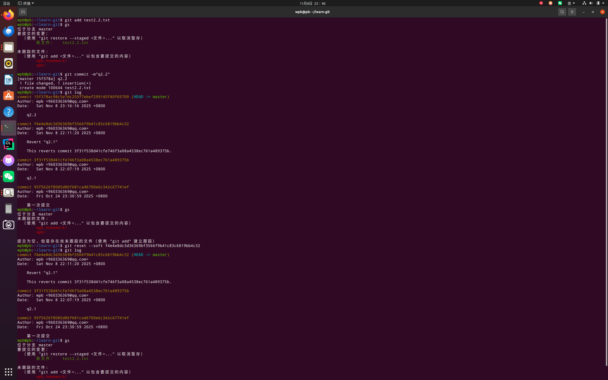
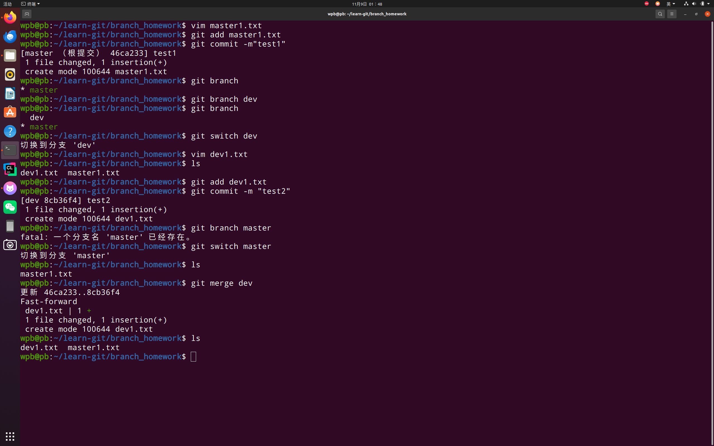
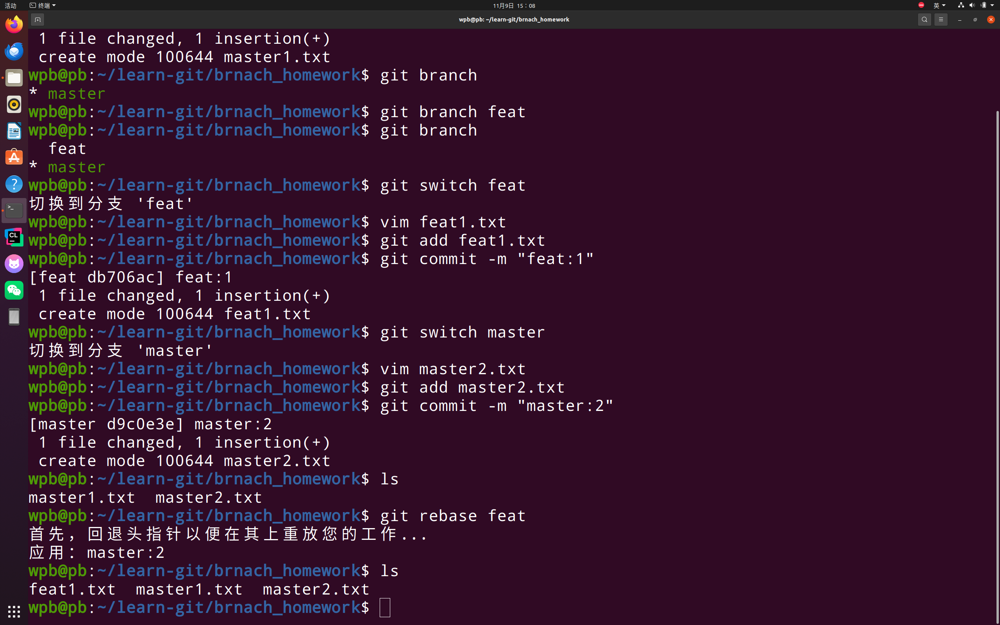
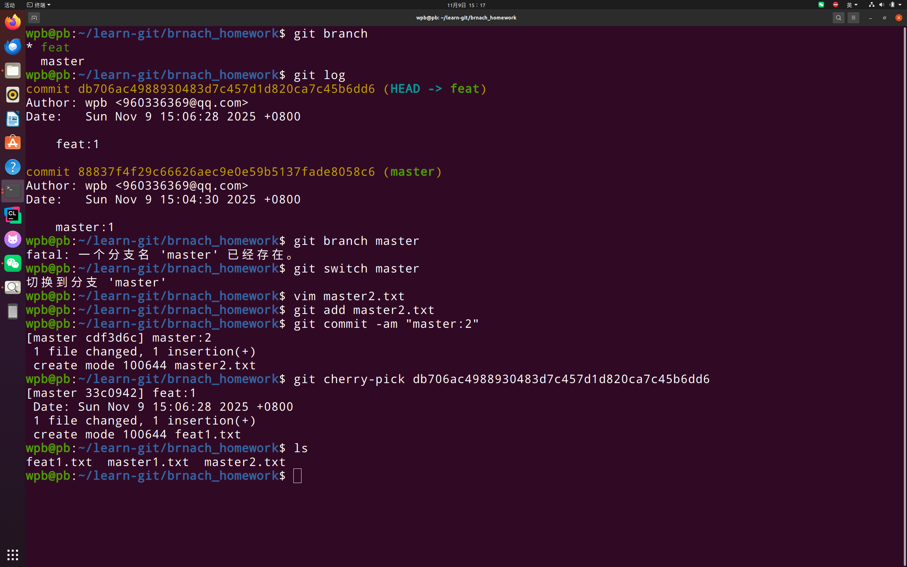

1.若你已经修改了部分文件、并且将其中的一部分加入了暂存区，应该如何回退这些修改，恢复到修改前最后一次提交的状态？给出至少两种不同的方式

方式1：使用git reset

回退已暂存的修改到工作区
git reset HEAD <file>

然后使用 checkout 回退工作区修改
git checkout -- <file>

方式2：使用 git restore（推荐）

回退工作区的修改（未暂存的文件）
git restore <file>

回退已暂存的修改
git restore --staged <file>

同时回退工作区和暂存区的修改
git restore --staged --worktree <file>

2.若你已经提交了一个新版本，需要回退该版本，应该如何操作？分别给出不修改历史或修改历史的至少两种不同的方式

不修改历史
使用 git revert

创建一个新的提交来撤销指定提交的更改
git revert <commit-hash>

撤销最近的一次提交
git revert HEAD

修改历史

使用 git reset --hard

硬重置到指定提交（会丢失之后的提交）
git reset --hard <commit-hash>

强制推送到远程（如果已推送）
git push -f origin <branch-name>

3.我们已经知道了合并分支可以使用 merge，但这不是唯一的方法，给出至少两种不同的合并分支的方式

方式一：使用 git merge

切换到目标分支
git checkout main

合并特性分支（如果可能则快进）
git merge feature-branch

方式二：使用 git rebase

在特性分支上变基到主分支
git checkout feature-branch
git rebase main

然后快进合并到主分支
git checkout main
git merge feature-branch

方式三：使用 git cherry-pick

选择性合并特定提交
git checkout main
git cherry-pick <commit-hash>

